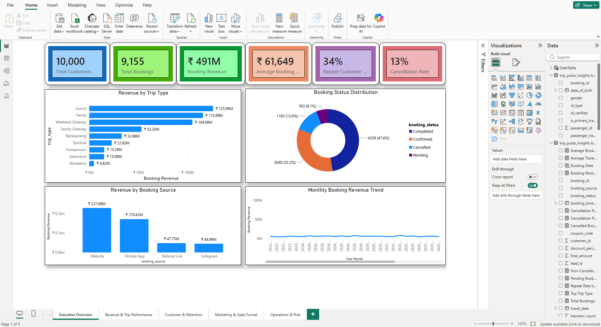
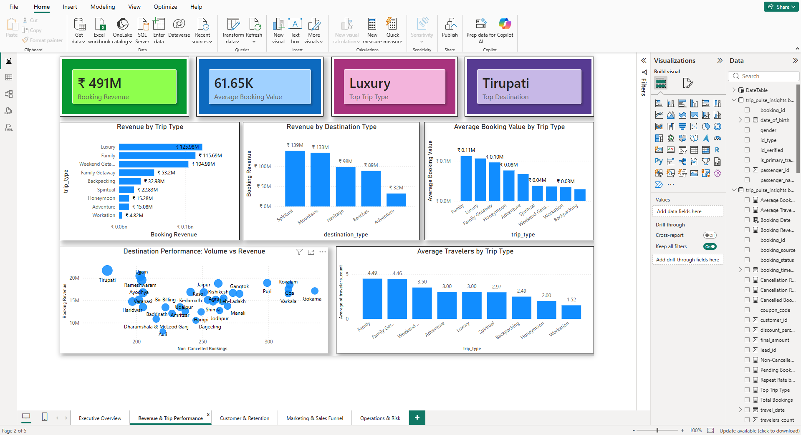
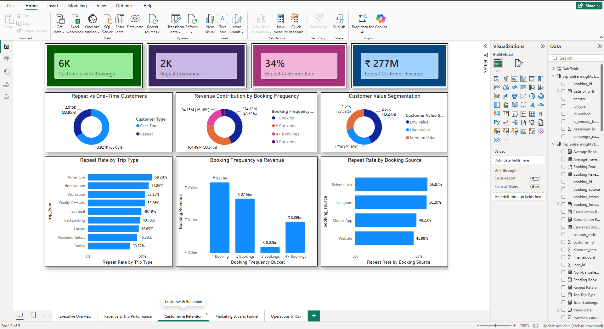
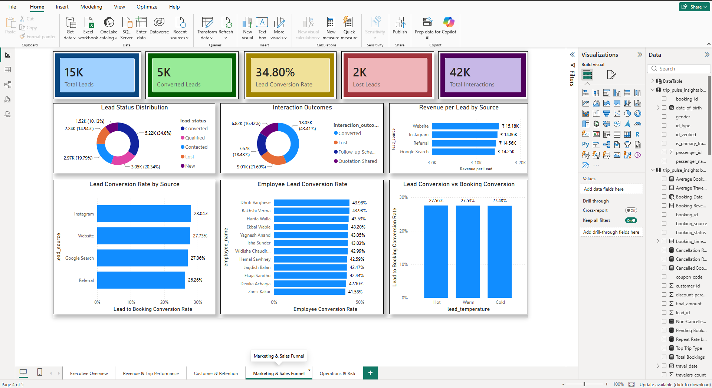
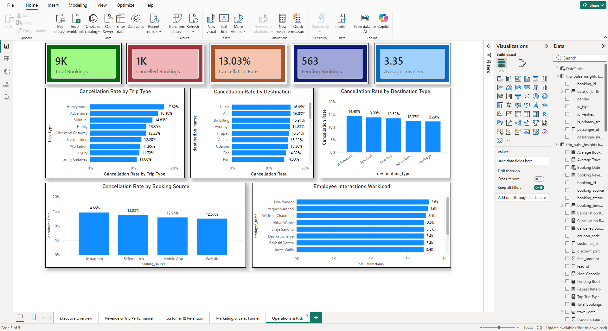

# TripPulse Insights — Travel Booking Analytics

An end-to-end data analytics portfolio project built around a **synthetic travel-booking dataset**, demonstrating how raw business data can be transformed into a relational database, business analysis, and an interactive Power BI dashboard.

## 📌 Project Overview

TripPulse Insights simulates a travel-booking business environment containing customers, bookings, destinations, trips, payments, reviews, leads, marketing campaigns, and employee interactions.

The project covers the complete analytics workflow:

**Python → Data Generation & Validation → MySQL → SQL Analysis → Power BI → Business Insights**

## 🎯 Business Objective

The objective is to analyze travel-booking data and answer practical business questions around:

- Revenue and booking performance
- Customer retention and repeat behaviour
- Trip and destination performance
- Marketing and sales funnel efficiency
- Booking-channel performance
- Cancellation patterns
- Customer value segmentation
- Employee workload and lead conversion

## 🛠️ Tools & Technologies

- **Python** — Pandas, NumPy, Faker, Matplotlib, Seaborn
- **MySQL** — Database design, data loading and querying
- **SQL** — Joins, aggregations, subqueries, CTEs, window functions
- **Power BI** — Data modelling, DAX and interactive dashboards
- **MySQL Workbench**
- **Git & GitHub**

## 📊 Dataset

This project uses a **synthetic/simulated business dataset** created specifically for portfolio analysis.

The database contains **13 interconnected tables** covering:

- Customers
- Destinations
- Trips
- Bookings
- Booking Passengers
- Payments
- Reviews
- Leads
- Lead Interactions
- Marketing Campaigns
- Customer Campaigns
- Trip Pricing
- Employees

More than **50,000 synthetic business records** were generated and validated using Python.

> **Note:** All business metrics in this project are simulated and do not represent a real travel company.

## 🔄 Project Workflow

### 1. Data Generation & Validation

Python and Faker were used to generate realistic synthetic business records.

Data-quality checks were implemented to validate:

- Missing values
- Duplicate records
- Primary-key uniqueness
- Foreign-key consistency
- Date validity
- Business-rule constraints
- Relationships between tables

### 2. Database Design

A relational MySQL database was designed with **13 interconnected tables**.

The schema uses:

- Primary keys
- Foreign keys
- Unique constraints
- Check constraints
- Appropriate data types
- Relationships between business entities

### 3. SQL Business Analysis

More than **50 SQL analyses** were conducted across different business areas.

Examples include:

- Executive KPI analysis
- Booking-status analysis
- Destination performance
- Revenue trends
- Customer retention
- Repeat-customer analysis
- Lead conversion
- Marketing-source performance
- Cancellation analysis
- Trip-type performance
- Customer value segmentation
- Employee workload
- Employee conversion efficiency

The repository contains both a **curated set of 30 representative analyses** and the **complete 50-query analysis file**.

## 📈 Power BI Dashboard

The final Power BI dashboard contains **5 interactive pages**.

### Dashboard Preview

#### 1. Executive Overview



#### 2. Revenue & Trip Performance



#### 3. Customer & Retention



#### 4. Marketing & Sales Funnel



#### 5. Operations & Risk



### 1. Executive Overview

Provides a high-level view of:

- Customers
- Bookings
- Booking revenue
- Average booking value
- Repeat customer rate
- Cancellation rate

### 2. Revenue & Trip Performance

Analyzes:

- Revenue by trip type
- Destination performance
- Average booking value
- Revenue by destination type
- Average travelers by trip type

### 3. Customer & Retention

Focuses on:

- Repeat vs one-time customers
- Booking frequency
- Customer revenue contribution
- Repeat rate by trip type
- Repeat rate by booking source
- Customer value segmentation

### 4. Marketing & Sales Funnel

Analyzes:

- Lead volume
- Lead conversion
- Lead sources
- Revenue per lead
- Interaction outcomes
- Employee conversion efficiency
- Lead temperature

### 5. Operations & Risk

Examines:

- Booking status
- Cancellation patterns
- Cancellation by trip type
- Cancellation by destination
- Cancellation by booking source
- Employee workload

## 💡 Key Business Insights

Analysis of the simulated dataset revealed several patterns:

- Repeat customers generated a disproportionately large share of total booking revenue.
- Customer value varied substantially across customer segments.
- Booking revenue was concentrated among a smaller number of trip categories.
- Booking channels showed differences in booking volume, revenue and repeat-customer behaviour.
- Cancellation rates varied across destinations and trip categories.
- Lead sources showed measurable differences in lead-to-booking conversion.
- Employee interaction workloads were distributed across the sales team, with differences in conversion efficiency.

## 📂 Repository Structure

```text
trippulse-insights/
│
├── sql/
│   ├── analysis_queries.sql
│   └── complete_analysis.sql
│
├── python/
│   ├── data_generation/
│   │   ├── customers.py
│   │   ├── destinations.py
│   │   ├── trips.py
│   │   ├── bookings.py
│   │   ├── booking_passengers.py
│   │   ├── payments.py
│   │   ├── reviews.py
│   │   ├── leads.py
│   │   ├── lead_interactions.py
│   │   ├── employees.py
│   │   ├── marketing_campaigns.py
│   │   ├── customer_campaigns.py
│   │   └── trip_pricing.py
│   │
│   ├── data_validation/
│   │   └── check_data.py
│   │
│   └── database_import/
│       ├── README.md
│       └── import_*.py
│
├── powerbi/
│   ├── TripPulse_Insights.pbix
│   ├── README.md
│   └── screenshots/
│       ├── 01_Executive_Overview.png
│       ├── 02_Revenue_Trip_Performance.png
│       ├── 03_Customer_Retention.png
│       ├── 04_Marketing_Sales_Funnel.png
│       └── 05_Operations_Risk.png
│
└── README.md
```

## 🚀 Skills Demonstrated

This project demonstrates practical experience in:

### Data Analytics

- Data cleaning
- Data validation
- Exploratory analysis
- KPI analysis
- Business analysis
- Customer segmentation

### SQL

- Joins
- Aggregations
- CTEs
- Subqueries
- Window functions
- Business analysis queries

### Python

- Pandas
- NumPy
- Faker
- Synthetic data generation
- Data validation

### Power BI

- Data modelling
- Relationships
- DAX
- KPI cards
- Interactive dashboards
- Business reporting

## 👩‍💻 Author

Saloni Singh

B.Sc. (Hons.) Mathematics with Research

Aspiring Data Analyst

LinkedIn: [Saloni Singh](https://www.linkedin.com/in/saloni-singh-math)

GitHub: [[saloni6319-cloud](https://github.com/saloni6319-cloud)

